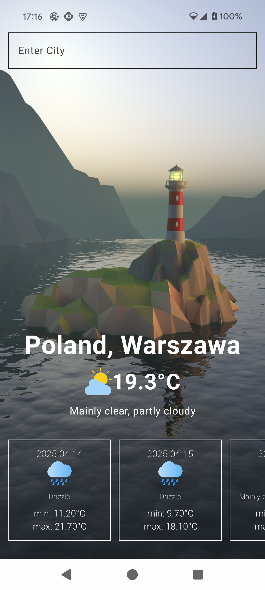
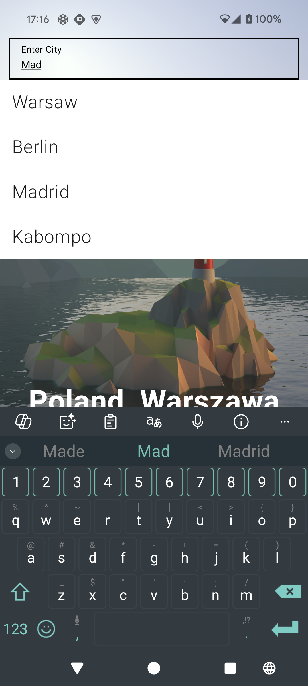
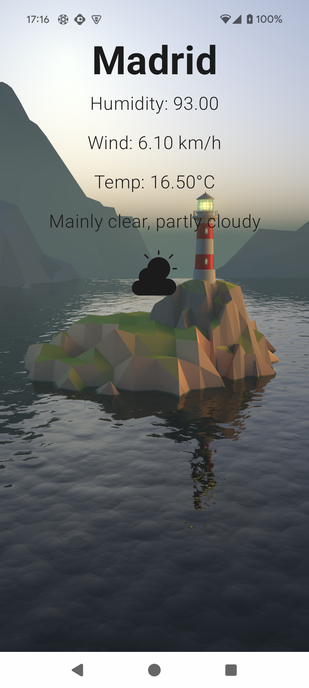
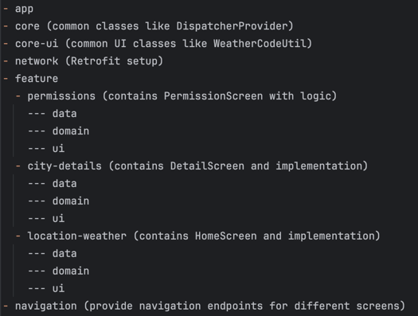

# OpenMeteo

This application was developed from scratch in just 8 hours using the following technologies:

- Jetpack Compose
- Retrofit
- Koin
- MVVM architecture
- Kotlin Flow and Kotlin Coroutines 

It integrates with the open-meteo.com API to provide weather data.

## It contains screens:

1. PermissionScreen 
It handles asking for Location permission which is required for app to work 

2. HomeScreen
It shows current location weather together with 5 days forecast and handle errors with loading data.

It also contains input field to search for different cities:

After selecting other location we are navigated to DetailScreen 

3. DetailScreen
Shows name of location and more info like humidity, description, wind speed or temperature.

## Known issues: 
1. Error handling on detail screen is not finished, but it is ready to implement similar to HomeScreen.
2. Retrieving location name is not possible from API, I have done it with Geocoder but I used deprecated method. Should be improved to cover all Android versions.
3. After granting permissions and navigating to HomeScreen we can see for short moment UI in denied state with X graphic.
4. When we go back from details page to home page then search list should be cleared 
5. There is no known way to load data from API by city name. API requires latitude or longitude. That means we should load find geolocation of city by it is name from different API. **In this app we just mockk that data.**  

## Architecture and Code Quality:

### Architecture

Right now application is monolith app, I tried to make sure that converting to multimodule architecture will be easy but I have not done it yet. 
Due to lack of time I can not finish it but in next refactor stage app should have such gradle modules structure: 

### Tests 

Application is not covered by any unit tests by lack of time. If I could I would choose MockK library, in long term I would also like to cover screens composables by using Paparazzi screenshot tests  

### Lifecycle 

Application is using MVVM and Jetpack Navigation to ensure that app behaves correctly when navigating between screens and to handle lifecycle properly, but it require a little bit more work to handle screen rotation. 